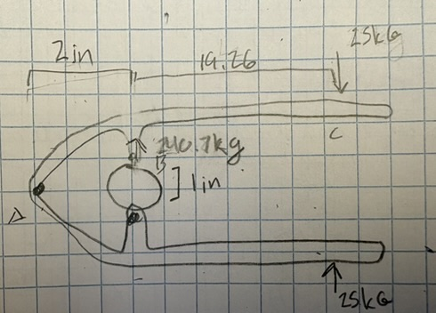

The goal for this project was to develop a nutcracker that would be capable of cracking a macadamia nut using only grip strength. This would require a device capable of multiplying the force applied by the hand enough to crush the nut.

The force required to break the nut was found to be 222.18 kg plus or minus 18.54 kg. (Schrauf et al., 2008) The average size of a macadamia nut was estimated to be 1 inch in diamterer. The minimum grip strength to use the device was selected to be 25 kg, which is the maximum grip strength for the 50th percentile of women. (Topend Sports) 

Simplicity was emphasised in the design. The premise is a simple lever system where the grip force is applied at a significant distance from the fulcrum, which increases the magnitude of the force on the nut which is located significantly closer to the fulcrum. The distance from the nut to the fulcrum was decided to be two inches, becuase that was the estimated minimum distance that the nut would have to be in order to comfortably fit into the device. The length of the lever arm was then calculated by balancing moments about the fulcrum, assuming a 25kg force down on the end of the handle and a 247 kg maximum force on the nut holding region. Note that 240.7 was the maximum end of the error tolorence for nut strength. 25l = 2(240.7), l = 19.3 inches. Thus, the handle length should be a little over 19.3 inches. 

This nutcracker design is not the most convenient for use because its large size makes it unweildy. It would have to be fairly heavy for the material of the nutcracker to withstand the shear forces in the handle, and the length of the handle may make it difficult to load the nut while holding the nutcracker. 
A much simpler design would be a nutcracker that rests on a table that one can operate by pressing down on the top lever. This would increase the amount of force one could apply to the mechanism, thus reducing the necessary length of the lever arms. Also, the weight would be less of a problem if the device did not need to be handheld. 

